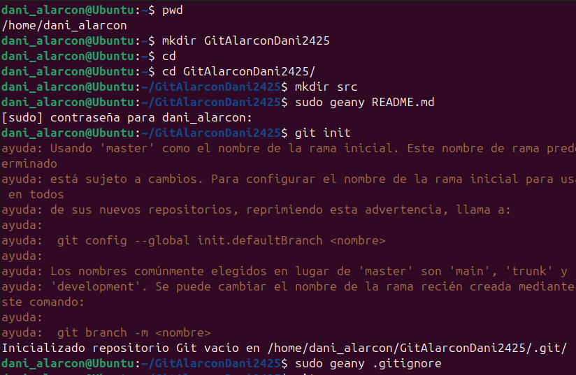
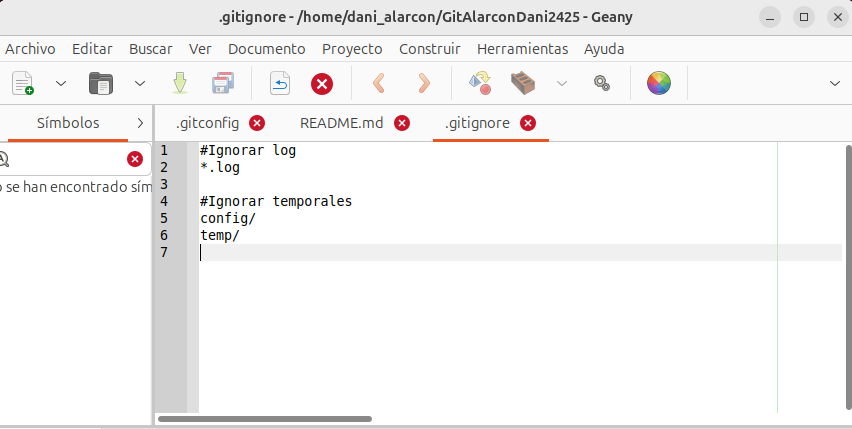
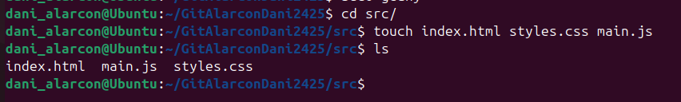
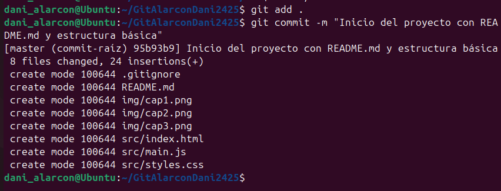
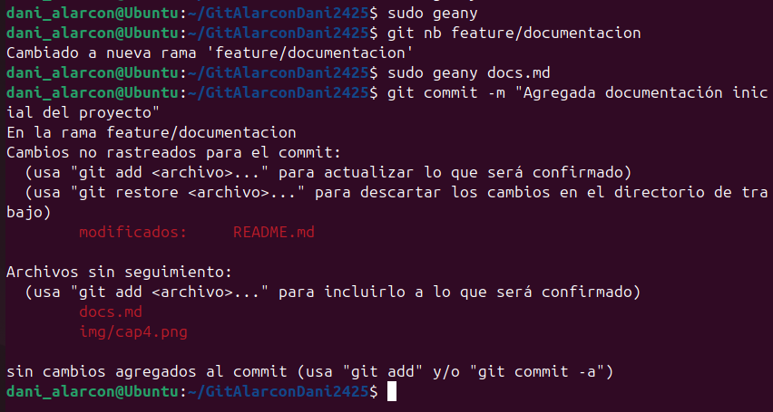
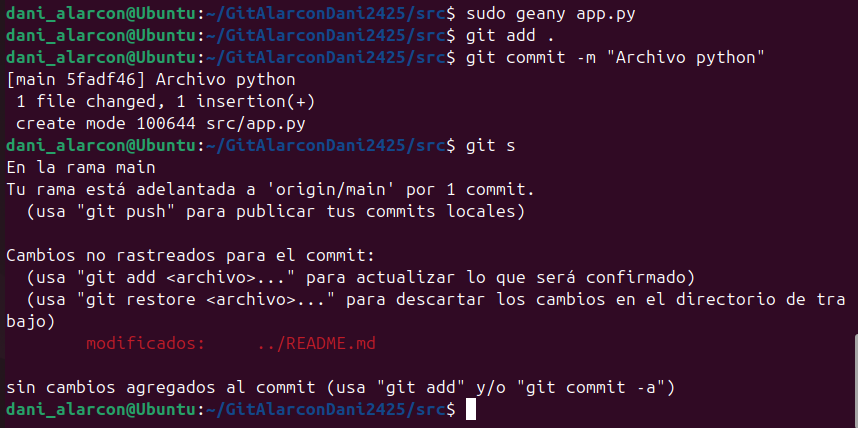
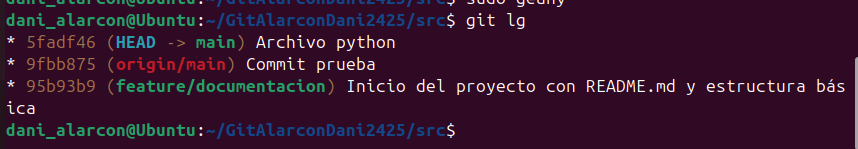
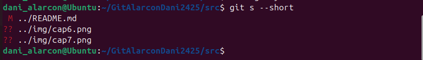

#Práctica 3 - GitHub y repositorio remoto
##Dani Alarcón

##Parte 1: Preparación del Proyecto

### 1. Crear directorios y archivos:

### 2. Inicializa Git:

- **¿Qué es el archivo .gitignore y para que sirve?**Es un archivo oculto para indicar lo que tiene que ignorar el repositorio

### 3. Primera confirmación:

## Parte 2: Colaboración en Equipo

## 1.Configura del repositorio remoto:

- **¿Qué pasa si creo un repositorio con el archivo README.md desde GitHub?** Sale el repositorio solo con el archivo README.md.
- **¿Qué pasa si crea un repositorio sin el archivo README.md desde GitHub?** Sale el repositorio vacio con un enlace para copiarlo y poder clonarlo.

	echo "# Practica3-GitHub" >> README.md
	git init
	git add README.md
	git commit -m "first commit"
	git branch -M main
	git remote add origin https://github.com/Dani-Alarcon/Practica3-GitHub.git
	git push -u origin main

## 2. Actualización del Proyecto:

## Parte 3: Gestión de Archivos y Cambios

### 1.Ediciones rápidas:

	**git status**

	**git log --oneline --graph --decorate --color**

	**git status --short**

## 2.Borrado y recuperación:
